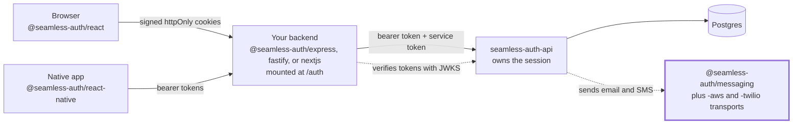

# Seamless Messaging

`seamless-messaging` is the public auth-messaging package family for SeamlessAuth.

It gives SeamlessAuth a small, explicit way to deliver auth emails and SMS without forcing adopters to rebuild OTP and magic-link flows themselves. SeamlessAuth owns the auth-message defaults; adopters choose transports, handlers, and optional overrides.

Current scope is intentionally narrow:

- TypeScript packages only
- the four auth flows SeamlessAuth sends today: email OTP, SMS OTP, magic link email, and passkey enrollment invite email
- AWS SES email
- AWS SNS SMS
- Twilio SMS

## Start here

New to Seamless Auth? The [self-hosted quickstart](https://docs.seamlessauth.com/start/quickstart/) runs the full stack locally with Docker. If Seamless hosts your auth instance, follow the [managed quickstart](https://docs.seamlessauth.com/start/managed-quickstart/) instead.

These packages are how `seamless-auth-api` delivers OTP and magic link email and SMS, so they attach to the API node in the diagram below.



[How the pieces connect](https://docs.seamlessauth.com/start/overview/#how-the-pieces-connect) explains each hop. [Compatibility matrix](https://docs.seamlessauth.com/build/ecosystem/#compatibility-matrix) lists which package versions work together.

## Packages

- `@seamless-auth/messaging`
- `@seamless-auth/messaging-aws`
- `@seamless-auth/messaging-twilio`

## What This Repo Solves

SeamlessAuth needs to send exactly these auth-related messages today:

- email OTP
- SMS OTP
- magic link email
- passkey enrollment invite email

This repo packages that responsibility into:

- a provider-agnostic core service
- channel transports for `email` and `sms`
- optional per-flow custom handlers
- optional message overrides

It is not a general notification platform or a marketing email system.

## Public Model

The consumer is `seamless-auth-api`, which builds its messaging service from these packages with `createAuthMessagingService(...)` and the AWS and Twilio transports. The `seamless-auth-server` adapters do not depend on these packages.

At integration time, an adopter should be able to provide:

- official transports like SES, SNS, and Twilio
- or custom per-flow handlers if they already own delivery infrastructure
- plus optional overrides when they want to customize message content

The core service keeps the auth-domain API small:

- `sendOtpEmail(...)`
- `sendOtpSms(...)`
- `sendMagicLinkEmail(...)`
- `sendEnrollmentInviteEmail(...)`: asks a user to sign in and add a passkey; the link opens the sign-in page and carries no credential

## Install

```bash
npm install @seamless-auth/messaging
npm install @seamless-auth/messaging-aws
npm install @seamless-auth/messaging-twilio
```

Install only the provider packages you need.

## Quick Start

```ts
import { createAuthMessagingService } from "@seamless-auth/messaging";
import { createAwsEmailTransport } from "@seamless-auth/messaging-aws";
import { createTwilioSmsTransport } from "@seamless-auth/messaging-twilio";

const authMessaging = createAuthMessagingService({
  appName: "Seamless Review",
  email: createAwsEmailTransport({
    region: process.env.AWS_REGION!,
    fromEmail: process.env.AUTH_EMAIL_FROM!,
  }),
  sms: createTwilioSmsTransport({
    accountSid: process.env.TWILIO_ACCOUNT_SID!,
    authToken: process.env.TWILIO_AUTH_TOKEN!,
    fromNumber: process.env.TWILIO_FROM_NUMBER!,
  }),
});

await authMessaging.sendOtpEmail({
  to: "user@example.com",
  token: "ABCDEF",
});

await authMessaging.sendOtpSms({
  to: "+15551234567",
  token: 123456,
});
```

## Why Channel Composition Matters

Twilio covers SMS, but not the email flows SeamlessAuth needs for launch.

So the package family is deliberately channel-based:

- AWS email + AWS SMS
- AWS email + Twilio SMS
- custom email handler + Twilio SMS

That keeps the core contract stable as future providers like SendGrid or Resend are added later.

## Current Status

This repo is no longer just a design sketch. It currently includes:

- the published core package
- published AWS email and SMS transports
- a published Twilio SMS transport
- default auth-message rendering
- handler and override support in the core service
- tests covering mixed-provider composition

This package family has also already been used to support a real SeamlessAuth integration path in the wider ecosystem.

## Documentation

- [Architecture](./docs/architecture.md)
- [Adopter User Story](./docs/adopter-user-story.md)
- [Provider Model](./docs/provider-model.md)
- [Roadmap](./docs/roadmap.md)
- [Agent Guidance](./AGENTS.md)

## Examples

- [Seamless Review API example](./examples/seamless-review-api/README.md)

## Relationship To SeamlessAuth

This repo was shaped by reviewing and integrating against:

- `seamless-auth-api`
- `seamless-auth-server`

That work pushed the design toward:

- small public packages
- explicit typed contracts
- thin provider adapters
- auth-focused defaults
- adopter-controlled transport choice

## Development

Use the workspace scripts at the repo root while iterating:

```bash
npm run lint
npm run format:check
npm run typecheck
npm test
```

Auto-fix helpers:

```bash
npm run format
npm run lint:fix
```

## Publishing

Releases go through [changesets](https://github.com/changesets/changesets), as in the other
seamless-\* repos. Do not publish or tag by hand.

1. A pull request that changes what adopters get adds a changeset (`npx changeset`). Its summary
   is the release note.
2. On merge, the release workflow opens or updates the `chore: version packages` pull request,
   which bumps the versions and the package changelogs.
3. Merging that pull request runs `npm run release:verify`, publishes to npm with provenance,
   tags each package and creates the GitHub releases.

The three packages are a fixed group: they always share one version, and the transports depend
on the matching `@seamless-auth/messaging`. Publishing needs the `NPM_TOKEN` secret.
